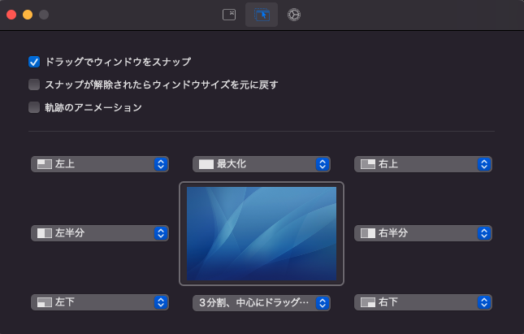

# mac_setting
## ソフト
- [Rectangle](https://rectangleapp.com)<br>
    
- [MonitorControl](https://github.com/MonitorControl/MonitorControl)
- [Mos](https://mos.caldis.me)
- [Karabiner](https://karabiner-elements.pqrs.org)
## Dock表示高速化
```
defaults write com.apple.dock autohide-delay -float 0; defaults write com.apple.dock autohide-time-modifier -int 1 ;killall Dock
```
